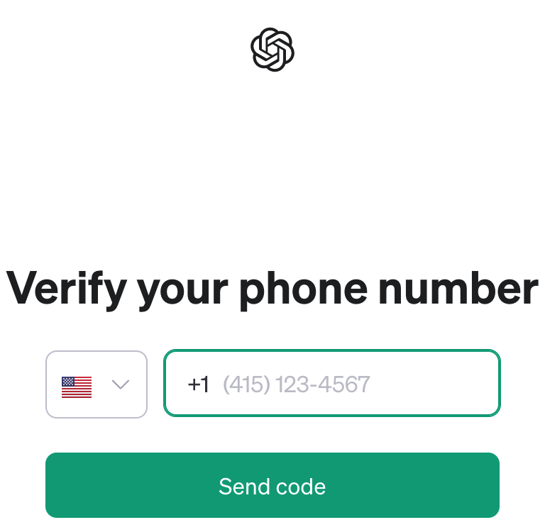

# Introduction to ChatGPT 

When presented with the following prompt:

> Please summarize the capabilities of ChatGPT and describe the differences between GPT-3.5 and GPT-4    

> Please provide this information as markdown

The following response was provided:

> Certainly! Here's the information in markdown format:
> 
> **Capabilities of ChatGPT**
> - Natural Language Understanding: ChatGPT comprehends and responds to text input in a conversational manner.
> - Text Generation: It generates coherent and contextually relevant text in response to prompts.
> - Language Translation: ChatGPT can translate text between different languages.
> - Text Summarization: It condenses longer texts into shorter summaries.
> - Conversational AI: ChatGPT can be used to build chatbots and virtual assistants.
> 
> **Differences between GPT-3.5 and GPT-4:**
> - *Model Size*: GPT-4 is likely to be larger and more powerful than GPT-3.5.
> - *Improved Understanding*: GPT-4 is expected to have a better understanding of context and nuances in language.
> - *Enhanced Multimodal Capabilities*: GPT-4 might have improved capabilities in processing images and audio.
> - *Reduced Bias and Safer Outputs*: GPT-4 may have improved mechanisms for mitigating biased or harmful content.
> - *Customization and Fine-Tuning*: GPT-4 is likely to offer enhanced customization options.
> - *Enhanced Multilingual Support*: GPT-4 may have improved multilingual capabilities.
> 
> Please note that this information is based on knowledge up to January 2022, and I do not have information on developments made to GPT-4 or subsequent models beyond that date.

Expanding on the limited response from ChatGPT 3.5 about the capabilities of GPT-4 [this research report](https://openai.com/research/gpt-4) from OpenAI provides a summary of some of the capabilities of their newly released GPT-4 model as a successor to GPT-3:

- Accepts image and text inputs, generates text outputs
- Builds upon lessons learned, updated theoretical foundations, and bugs that were eliminated in GPT-3.5
- Benchmark testing 
    - Exam Performance - significant improvement across a range of exam topics between GPT-3.5 and 4
    - Machine Learning benchmarks - outperforms many existing large language models and optimized state-of-the-art models
    - Testing across multiple languages - outperformed in 24/26 languages GPT-3.5 and two other large language models

Some interesting and brief YouTube introductory videos related to the technology behind ChatGPT
- ChatGPT in Sixty Seconds: https://www.youtube.com/watch?v=u19AfT3ZaSI
- GPT-3 in Sixty Seconds: https://www.youtube.com/watch?v=omvGqDv8cEU
- Word Embeddings in Sixty Seconds: https://www.youtube.com/watch?v=R3xHRSMCG5g
- Positional Embeddings in Sixty Seconds: https://www.youtube.com/watch?v=3zgVs57SkuM
- Attention in Sixty Seconds: https://www.youtube.com/watch?v=nhCkiBo92Hs

There are longer and more detailed videos on each topic in addition to the short ones linked above. 

## Setting Up Your ChatGPT Account

In order to use the ChatGPT web interface or Application Programming interface you have to first set up an OpenAI account. The account is free, but if you want to use GPT-4 you need to upgrade your account to the ChatGPT Plus level that requires a monthly subscription. Everything we will be doing for the workshop can be accomplished with a free OpenAI Account. To set up your free OpenAI account you will need to sign-in using either your email address, or authenticate through an existing Google, Microsoft, or Apple account. In addition, as part of the sign-up process you will need to provide a phone number that OpenAI will use to send you a confirmation code that needs to be entered as part of the account creation process. The sign-up process is as follows:

1. Go to the ChatGPT Home page and click on the "Sign up" button to start the account creation process. https://chat.openai.com/auth/login

2. Choose the authentication method you would like to use for your OpenAI account: email-based, or Microsoft, Google, or Apple account. 

3. Depending upon your selected authentication method you will be prompted with the corresponding account login (for Microsoft, Google, of Apple accounts), or email and password registration information. 

4. Enter your name and birthdate that will be associated with your account.

5. Enter the phone number to which the account verification code should be sent. 

6. After submitting your phone number you will be sent a code that you need to enter in the next dialog to confirm that you are the owner of the number to which the confirmation code was sent. 

7. Following verification you will be able to login and start using the web interface. 

In the next workshop we will generate an API key that you can use for submitting requests to the OpenAI Application Programming Interface.

Once you are logged into your OpenAI account you can start using the web interface to interact with the GPT-3.5 model. 

## Working with the Web Interface

Demonstrating entry of prompts into the ChatGPT web interface:
- Basic math: https://chat.openai.com/share/0d363273-ca4c-4200-aec5-d139b404074e
- Summarize Tom Sawyer: https://chat.openai.com/share/b2dd84bd-7eca-4ccf-8fc5-f9b655cd3da0

ChatGPT Best Practices: https://platform.openai.com/docs/guides/gpt

