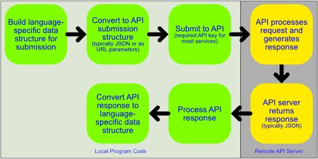

# Programmatic Interaction with ChatGPT through the OpenAI Application Programming Interface

The [ChatGPT web interface](https://chat.openai.com/) can be useful for exploring the capabilities of OpenAI's generative AI models in an interactive way, but if you want to routinely execute similar requests you might want to use the *Application Programming Interface (API)* provided by OpenAI to automate the submission of prompts and receipt of responses. Any programming language that can compose and submit a web service request to a remote server and process the response can be used to interact with the OpenAI API.

Some programming languages have libraries that are specifically designed to streamline the use of the ChatGPT API (including both R and Python) but in other cases you might need to build your own interaction workflow. At a high level API interactions generally follow the following process:

{width="691"}

## Prerequisites

Many public APIs require that you are registered as a user of their API and support some sort of mechanism for including in your interactions with their system credentials that link the request to your account. OpenAI follows this model and requires:

1.  That you create an account with OpenAI
2.  That you generate an API key associated with your account that will be used when submitting requests to their system.

The use of an API key linked to your OpenAI account enables usage tracking by OpenAI that supports accounting (i.e. usage against a usage credit [\$]) and [submission token and rate limiting](https://platform.openai.com/account/limits) (i.e. the number tokens and/or requests that can be submitted/minute/day). **OpenAI provides a \$5 credit towards API usage for free OpenAI accounts.** Usage beyond this credit requires a paid OpenAI account against which API usage can be charged.

### Setting up your OpenAI Account and API Key

You can set up a single [OpenAI](https://openai.com/product) account that can be used for both their web interface and their [developer platform](https://platform.openai.com/docs/overview).

Once you have an OpenAI account you can login to their [developer platform](https://platform.openai.com/docs/overview) and from there access their [API keys](https://platform.openai.com/api-keys) page. From there you can create and manage API keys that can be used to programmatically interact with their APIs.

**When you generate a new API key store it in a secure place. You cannot see or access the full key through their interface after you create it.**

**When you use your API key in your code do not hard code it into your code - use some sort of configuration file, environment variable, temporary storage mechanism for getting your API key into your program.**

You can track your API usage (i.e. cost and activity) through the ApenAI [usage page](https://platform.openai.com/usage) after you have logged into their [developer platform](https://platform.openai.com/docs/overview).

## Experimenting with the OpenAI Chat Playground

OpenAI provides a [playground](https://platform.openai.com/playground?mode=chat) where we can experiment with interactions with ChatGPT models, parameters that change the behavior of the models, and view code in multiple languages that implement the process modeled in the playground.

Experiment with the following input - leaving all options at their default values

`[SYSTEM] You are a high school student`

`[USER] Please summarize the plot of Mark Twain's novel Tom Sawyer in 200 words or less.`

**Exercise:** Experiment with changing the options and see what happens with the responses.

How do the Model options on the right impact the results we get? ([chat API reference](https://platform.openai.com/docs/api-reference/chat/create))

-   Mode (`model`): The model you choose has its own predefined performance characteristics, corpus of training data, and limits on input and output size in tokens

-   Temperature (`temperature`): Ranges from 0-1, with 0 being highly deterministic (i.e. results are likely to be more consistent from prompt to prompt) and 1 being highly random (sequential prompts are likely to produce different responses). **Setting this AND Top P is not recommended.**

-   Maximum Length (`max_tokens`): The maximum number of tokens to include in the completion (response)

-   Stop Sequences (`stop`): String, array, or null indicating that the API will stop generating response tokens

-   Top P (`top_p`): Defines a probability filter through which candidate tokens will be passed. Ranges from 0-1, with values less than 1 filtering out the top fraction of candidate tokens matching the value (i.e. a value of 0.1 only considers the top 10% of candidate tokens). **Setting this and Temperature is not recommended.**

-   Frequency Penalty (`frequency_penalty`): Ranges from -2 to 2, defaulting to 0. Values above 0 penalize tokens based on their frequency in the response so far, reducing the likelihood of repetition in the generated response.

-   Presence Penalty (`presence_penalty`): Ranges from -2 to 2, defaulting to 0. Values above 0 penalize tokens that have already appeared, increasing the likelihood that new topics will appear in the response.

### Python Code Generation and Experimentation

The playground provides a code generator for a number of languages for the chat captured in the playground. Here is the Python code associated with the API calls from the playground that we demonstrated:

``` python
# This code is for v1 of the openai package: pypi.org/project/openai
from openai import OpenAI
client = OpenAI()

response = client.chat.completions.create(
  model="gpt-3.5-turbo",
  messages=[
    {
      "role": "system",
      "content": "You are a high school student"
    },
    {
      "role": "user",
      "content": "Please summarize the plot of Mark Twain's novel Tom Sawyer in 200 words or less. "
    },
    {
      "role": "assistant",
      "content": "Tom Sawyer is a mischievous and adventurous young boy living in the fictional town of St. Petersburg, Missouri, in the mid-1800s. He lives with his Aunt Polly, his half-brother Sid, and his cousin Mary.\n\nTom is known for his cleverness and knack for getting into trouble. He often skips school, preferring to spend his time exploring the nearby woods and playing with his friends, Joe Harper and Huckleberry Finn. Together, they form a band of pirates and have various adventures.\n\nOne day, Tom witnesses a murder committed by Injun Joe, a dangerous criminal. Tom and Huck swear to keep it a secret, but their guilt and fear haunt them. Meanwhile, Tom develops a crush on Becky Thatcher, a new girl in town, and tries to impress her with his bravery.\n\nTom and Huck stumble upon a hidden treasure, but Injun Joe discovers their secret and becomes determined to find it for himself. In the end, Tom and Huck manage to outsmart Injun Joe and retrieve the treasure.\n\nThe novel also explores themes of friendship, loyalty, and the contrast between the freedom of childhood and the responsibilities of adulthood. Tom's adventures and growth throughout the story ultimately teach him valuable life lessons about honesty, bravery, and the importance of doing what is right."
    }
  ],
  temperature=1,
  max_tokens=1024,
  top_p=1,
  frequency_penalty=0,
  presence_penalty=0
)
```

There are a few things to note about this code:

-   It imports the [OpenAI library](https://github.com/openai/openai-python) which needs to be installed in your Python environment before it can be used. This can be done by opening up a new terminal environment in in the Jupyter environment and executing the following command: `pip install openai`

-   You need to provide your API key, either as part of the request being submitted or as an environment variable. For testing purposes I typically use a library that prompts me for a "secret" that I don't want to store in my code. In python I use the `getpass` library's `getpass` function to do that.

`import getpass`

`api_key = getpass.getpass(prompt = "OpenAI API Key")`

`client = OpenAI(api_key = api_key)`

-   It does not provide any code for processing the output of the API call. We need to add that to our code to do anything interesting. We can do that by creating a python dictionary from the returned completion model using the `model_dump()` method of the returned response object.

`response_dict = response.model_dump()`

-   Since we provided the system response that was generated by OpenAI as part of the code the resulting response echoed that content. **To get a new unique response we need to remove the last dictionary in the request that includes the "role":"Assistant" content.**

Here is an updated code block that addresses these issues

``` python
# This code is for v1 of the openai package: pypi.org/project/openai
from openai import OpenAI
import getpass

api_key = getpass.getpass(prompt = "OpenAI API Key")

client = OpenAI(
    api_key = api_key
)

response = client.chat.completions.create(
  model="gpt-3.5-turbo",
  messages=[
    {
      "role": "system",
      "content": "You are a high school student"
    },
    {
      "role": "user",
      "content": "Please summarize the plot of Mark Twain's novel Tom Sawyer in 200 words or less. "
    },
  ],
  temperature=1,
  max_tokens=1024,
  top_p=1,
  frequency_penalty=0,
  presence_penalty=0
)

model_dict = response.model_dump()
print("The generated description is:\n\n")
print(model_dict['choices'][0]['message']['content'])
```

### Extension of ChatGPT API Concepts to R

The ChatGPT Playground does not provide sample R code for interacting with their API. Because of this we need to incrementally build up our code in R to perform our API tasks. Following the process that we already went through in python we need to perform the following steps:

-   Import the [OpenAI](https://cran.r-project.org/web/packages/openai/index.html) R package - fortunately there is one that has already been developed

-   Capture our API key to use as part of the generation of the API call to OpenAI ([blog post on 'How to Avoid Publishing Credentials in Your Code'](https://rviews.rstudio.com/2019/03/21/how-to-avoid-publishing-credentials-in-your-code/))

-   Build our ChatGPT chat completion request and submit it

-   Process the response to the request

The corresponding code to accomplish this is:

``` r
library(openai)

.api_key <- rstudioapi::askForPassword("OpenAI API Key")

response <- create_chat_completion(
  model = "gpt-3.5-turbo",
  messages = list(
    list(
      "role" = "system",
      "content" = "You are a high school student"
    ),
    list(
      "role" = "user",
      "content" = "Please summarize the plot of Mark Twain's novel Tom Sawyer in 200 words or less. "
    )
  ),
  openai_api_key = .api_key,
  temperature = 1,
  max_tokens = 1024,
  top_p = 1,
  frequency_penalty = 0,
  presence_penalty = 0
)

print(response$choices$message.content)
```

## Why Use the API?

There are many reasons for having API access to a tool like ChatGPT (or the other AI models provided by OpenAI). Here are just a few:

-   Having full access to the model options that are not directly exposed through the web interface

-   Exclusion of prompts and responses from OpenAI's continued training of their models (as documented in their *current* policies)

-   Being able to replicate prompt-response cycles to assess:

    -   Impacts of changing model parameters

    -   Change in responses through time

-   Automating the process of developing and submitting model tuning data

-   Repeated execution of prompts for large collections of inputs (e.g. retrieving summaries of books for a long list of titles)

-   Generating text from form-based user inputs
